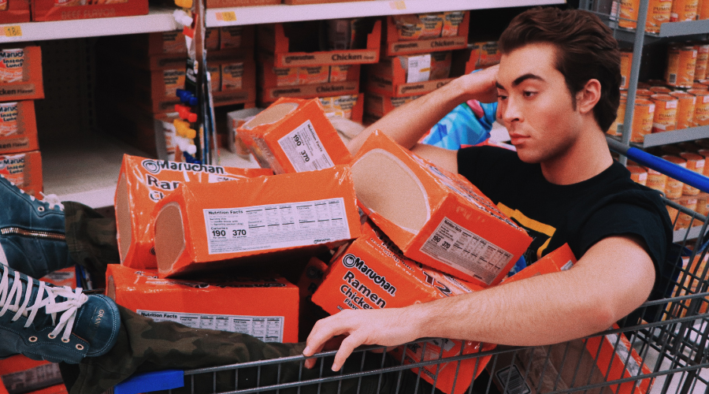

<h1 align="center"> CDMT Team: Project Feed Jeff </h1>

## Summary
Jeff, a lovely young gentleman has just started his first semester at University of Texas at San Antonio (UTSA). Like many first-time students, a college budget is no joke, especially when you'e a freshman living in the dorms, like Jeff here. Jeff is currently attending UTSA and is confined to a tiny dorm room with no toaster, a little mini fridge that barely works, and a microwave that’s older than his parents. Jeff often wonders, "How can I stretch my $20 dollars to next week?" 

By saying the magic words, "Like a good neighbor, CDMT is there!" Out of thin air comes **C**ool **D**ata **M**anagement **T**eam!

The CDMT Team came together to understand Jeff's request. 
* List request included the following:
* List of Stores near UTSA
* List of common Foods most College students eat 
* List of Brands
* List of Price

With a wave of our wand "bippity boppity boo" outcomes our page to help students find the best priced meal for their budgets!

                                                                                                                                    
<h1 align="center"> Methodology </h1>

## Data Collection
We started with a scrape of the Walmart and WholeFoods databases. After scraping for our desired food items we ended up with 206 items for Jeff to choose from. We then took the data from the different websites and gathered them into an SQLite database. We split the columns using <b>Brand</b>, <b>Name</b>, <b>Price</b> , <b>Type</b>, and <b>Store</b> so that Jeff would be able to specifically choose which products he'd like to see through different visualizations. 

Walmart Source URL: https://www.walmart.com/browse/shop-by-brand/food-grocery/3734780_7455738

WholeFoods Source URL: https://www.wholefoodsmarket.com/products

## Creating Visualizations
After initializing a Flask-powered API, we used Heroku to deploy the webpage to the cloud so that Jeff would be able to use the prototype product as soon as possible. Project: Feed Jeff decided to use a combination of <b>plotly</b> and <b>charts.js</b> to create the visualizations on the webpage. Our team believes that utilizing these two libraries in combination would be the best way of achieving the most effective visualizations for Jeff to make his selections. 

<b> No Need to Wait Any Longer! It's Time to Showcase our Protoype App! </b>

<h1 align="center"> Conclusion </h1>

## Limitations 
* Unable to scrape more websites due to:
  * Time Constraints 
  * Robot wall that protected against scraping 
  * API's had payment or authority requirements

## Future Goals 
* Project: Feed Jeff has several ideas in order to improve Jeff's culinary experience: 
  * Add more options for stores and foods
  * Add nutritional value of products
  * Create a Machine Learning Enviroment in order to better log Jeff's choices and provide suggestions

<h1 align="center">Project 3 Team</h1>

  <b>
  - Celenia Chapa
  - Tyler Cutrer
  - Matthew Villareal
  - Daniella Mayoral
  </b>
 
Website: https://store-foods.herokuapp.com/
